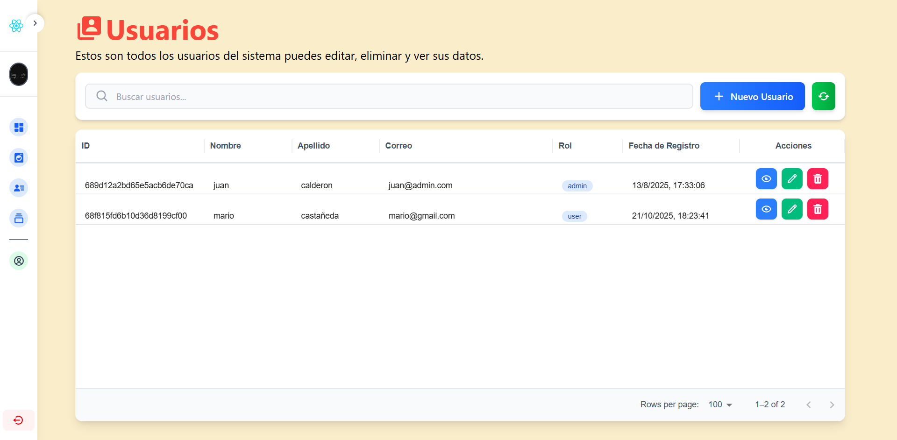
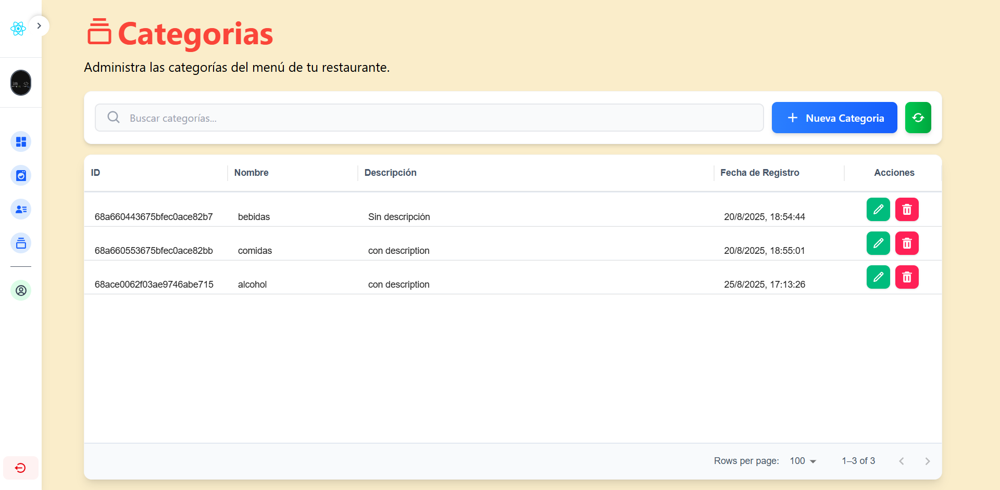

# Restaurant Web app Code base

## Descripción
Aplicación web para restaurante con backend en NestJS y frontend en React. Incluye autenticación JWT, gestión de usuarios y productos, toma y administración de órdenes, reportes con gráficos y tablas, filtros locales en cliente, refetch manual y exportación de reportes a Excel.

## Características Principales


### Backend (NestJS)
- **Autenticación JWT**: Implementación segura de JSON Web Tokens para manejo de sesiones
- **Seguridad**: Encriptación de contraseñas y protección de rutas
- **Seguridad**: JWT, roles (admin, caja) y guards en endpoints
- **Validación de Datos**: Uso de class-validator para validación de entrada
- **Subida de Imágenes**: Soporte para subida de imágenes de perfil usando Multer
- **Base de Datos MongoDB**: Almacenamiento de datos usando Mongoose
- **Arquitectura Modular**: Estructura organizada siguiendo los principios de NestJS
- **API RESTful**: Endpoints bien estructurados para usuarios, categorías, ordenes y reportes
- **Middleware de Autenticación**: Verificación de tokens y roles de usuario
- **Manejo de Archivos**: Sistema robusto para gestión de imágenes de perfil
- **Módulos**: usuarios, productos, categorias y órdenes
- **Órdenes**: creación, listado diario, por rango de fechas, actualización de estado, eliminación
- **Reportes**: estadísticos por rango (byStatus, byOrderType, totalRevenue) y exportación a Excel con ExcelJS

### Frontend (React + Vite)
- **Interfaz Moderna**: Diseño responsive usando Tailwind CSS
- **Gestión de Estado**: Manejo eficiente del estado de la aplicación usando Zustand
- **Formularios Interactivos**: Validación en tiempo real y feedback visual
- **Vista Previa de Imágenes**: Funcionalidad para previsualizar imágenes antes de subirlas
- **Notificaciones**: Sistema de notificaciones usando Notyf
- **Rutas Protegidas**: Implementación de rutas privadas y públicas
- **Tablas de Datos**: Implementación de DataTables con funcionalidades de búsqueda y filtrado
- **Modales Interactivos**: Sistema de modales para edición y eliminación de registros
- **Navegación Intuitiva**: Menú de navegación adaptativo según el rol del usuario
- **Reportes de Ventas**: página de admin con Recharts, @mui/x-data-grid y KPIs
- **Filtros en Cliente**: fecha y estado aplicados localmente sobre data ya obtenida
- **Refetch Manual**: botón “Buscar” para solicitar/actualizar data al backend
- **Exportación a Excel**: botón “Exportar Excel” que descarga los reportes por rango
- **Componentes Reutilizables**: DataTableReports para tablas basadas en MUI DataGrid

## Prácticas Implementadas
- Arquitectura limpia y modular
- Principios SOLID
- Manejo de errores consistente
- Validación de datos robusta
- Código tipado con TypeScript
- Documentación clara y mantenible
- Optimización de peticiones al servidor
- Gestión eficiente del estado global
- Responsive Design
- Patrones de diseño modernos

## Tecnologías Utilizadas
- **Backend**:
  - NestJS
  - MongoDB con Mongoose
  - JWT
  - Multer para manejo de archivos
  - Class Validator
  - Bcrypt para encriptación
  - Cookie Parser
  - CORS

- **Frontend**:
  - React
  - Vite
  - Tailwind CSS
  - Axios
  - React Router DOM
  - Notyf
  - Zustand
  - React Query
  - Material-UI DataGrid
  - React Icons
  - @tanstack/react-query
  - @mui/x-data-grid
  - Recharts
  - TypeScript

## Estructura del Proyecto
```plaintext
├── backend/
│   ├── src/
│   │   ├── orders/        # Órdenes: service, controller, DTOs, esquema
│   │   ├── products/      # Productos: CRUD y subida de imágenes
│   │   ├── user/          # Usuarios
│   │   ├── auth/          # Autenticación
│   │   ├── categories/    # Categorías de productos
│   │   ├── assets/        # Decorators, guards, interceptors
│   │   └── config/        # Configuración
│   └── uploads/           # Almacenamiento de imágenes
└── frontend/
    ├── src/
    │   ├── Api/           # Servicios de API (orders/products/...)
    │   ├── assets/        # Recursos estáticos (imágenes, estilos)
    │   ├── components/    # Reutilizables (DataTables, modals, UI)
    │   ├── hooks/         # React Query y hooks propios
    │   ├── pages/
    │   │   └── admin/
    │   │       └── components/OrdersReport.tsx  # Reportes con gráficos/tabla/export
    │   │   └── caja/
    │   │   
    │   └── store/         # Estado global
    └── public/
```

## Características de Seguridad
- Encriptación de contraseñas con bcrypt
- Validación de tokens JWT
- Protección contra ataques CSRF
- Validación de datos en frontend y backend
- Manejo seguro de sesiones con cookies HttpOnly
- Protección de rutas basada en roles (admin/user)
- Sanitización de datos de entrada
- Manejo seguro de archivos
- Políticas de CORS configuradas
- Validación de tipos con TypeScript

## Funcionalidades de Usuario
- Registro con imagen de perfil
- Inicio de sesión seguro
- Visualización y edición de perfil
- Cierre de sesión
- Panel de administración (solo admin)
- Gestión de usuarios (solo admin)
- Gestión de categorías (solo admin)
- Búsqueda y filtrado de registros
- Previsualización de imágenes
- Notificaciones de acciones

## Capturas de Pantalla

### Página de Inicio de Sesión

*Interfaz de inicio de sesión con validación en tiempo real y diseño responsivo*

### Página de Registro

*Formulario de registro con previsualización de imagen de perfil*

### Pagina Principal

*Previsualización de la pagina principal del restaurante*

### Panel de Administración

#### Navegación del Administrador

*Barra de navegación del panel de administración con acceso a todas las funcionalidades*

#### Gestión de Usuarios (admin)

*Panel de administración de usuarios con tabla de datos y acciones de edición/eliminación*

#### Gestión de Categorías (admin)

*Interfaz de gestión de categorías con funcionalidades de búsqueda y acciones CRUD*

#### Gestión de Productos (admin)


*Interfaz de gestión de productos con funcionalidades de búsqueda y acciones CRUD*

#### Reportes de ventas (admin)

*Interfaz de reportes de ventas con gráficos y datos de rendimiento*

## Tomar Orden

### Confirmar orden (Mesa)

### Confirmar orden (Llevar)

*Interfaz de caja para tomar pedidos del cliente*

### Ver Ordenes

*Interfaz de caja para ver pedidos actuales*